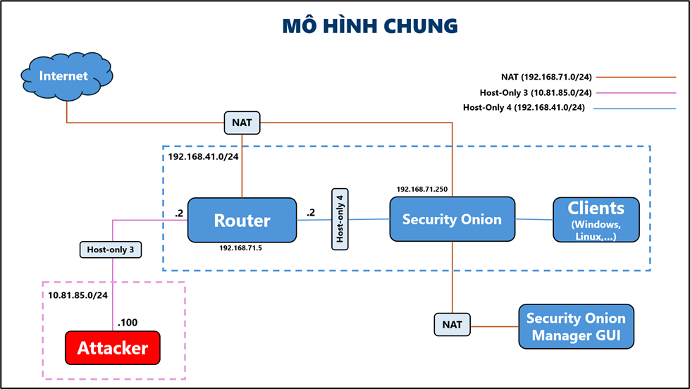
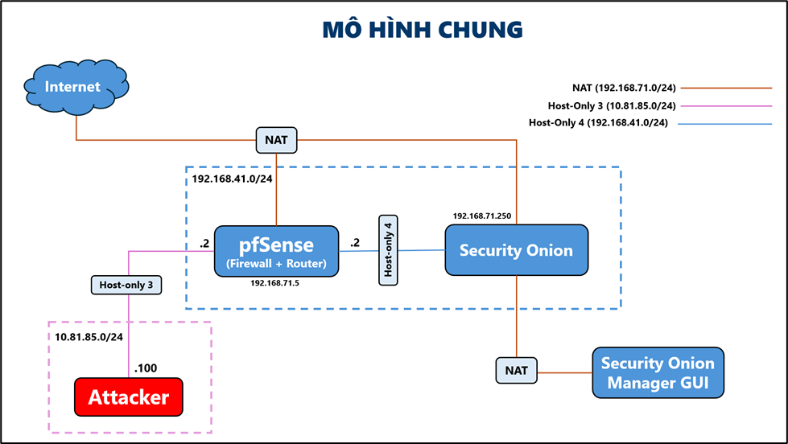
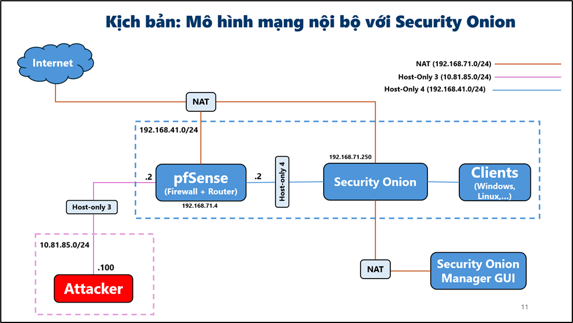
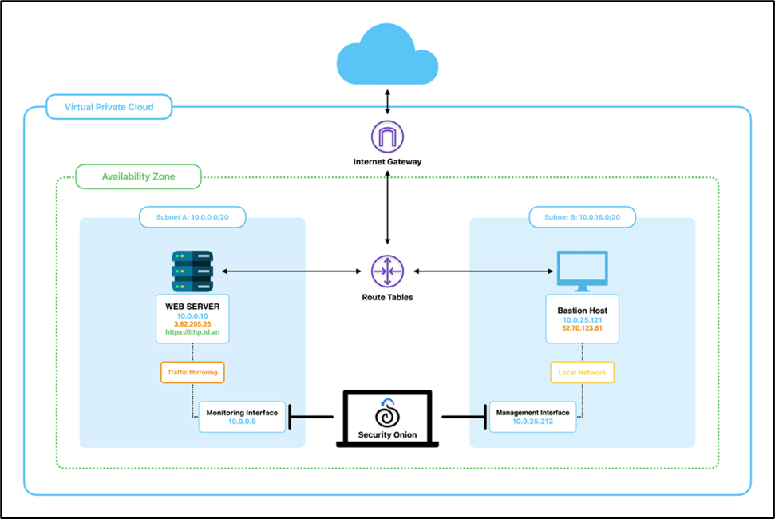
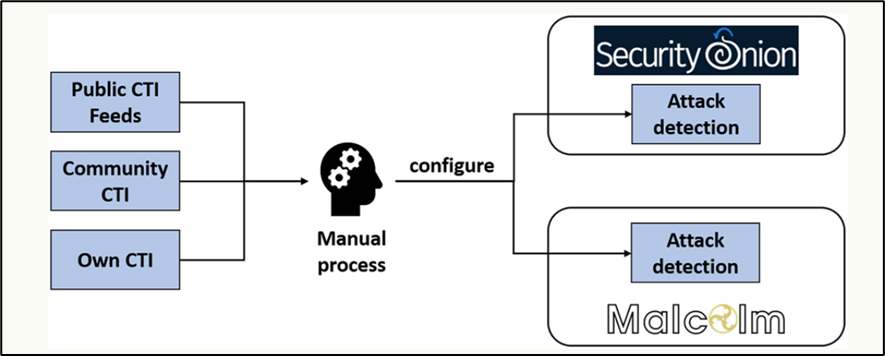

# Security Onion IDS Project

## Overview

Security Onion is a free, open-source Linux distribution designed for intrusion detection, enterprise security monitoring, and log management. Built on Ubuntu, it provides a comprehensive Network Security Monitoring (NSM) platform that combines multiple security tools into a unified solution.

### Theoretical Foundation

Security Onion implements a layered security approach based on the principle of **Defense in Depth**. The platform operates on the NSM methodology, which focuses on:

- **Full Packet Capture**: Complete network traffic recording for forensic analysis
- **Intrusion Detection**: Real-time analysis using signature-based and anomaly-based detection
- **Network Metadata**: Statistical summaries and connection logs for behavioral analysis
- **Alert Data**: Prioritized security events requiring investigation

### Core Architecture Components

The platform integrates several industry-standard tools into a cohesive ecosystem:

- **Suricata**: High-performance Network IDS/IPS engine with multi-threading capabilities
- **Zeek (Bro)**: Network analysis framework providing detailed connection logs and metadata
- **Elasticsearch**: Distributed search and analytics engine for log storage and indexing
- **Kibana**: Data visualization and dashboard platform for security analytics
- **Wazuh**: Host-based intrusion detection and security information management

### Detection Methodologies

Security Onion employs multiple detection techniques:

1. **Signature-based Detection**: Uses predefined rules to identify known threats and attack patterns
2. **Anomaly-based Detection**: Establishes baseline behavior and identifies deviations
3. **Behavioral Analysis**: Monitors network patterns and user activities for suspicious behavior
4. **Threat Intelligence Integration**: Incorporates IOCs and TTPs from external feeds

**System Requirements:** 8GB+ RAM, 4+ cores, 200GB+ storage, 2+ NICs

## Deployment Scenarios

### 1. Standalone Mode with Dual NIC
**Architecture:** Single-node with separated management and monitoring interfaces
- **Use Case:** Small networks, educational environments, testing
- **Benefits:** Simple deployment, cost-effective, isolated traffic
- **Demo:** [Standalone Mode Demo](https://youtu.be/bWiu8lMXAZk?si=wuvnwz9h18eOClaS)

### 2. pfSense Firewall Integration
**Architecture:** Security Onion integrated with pfSense for perimeter defense
- **Use Case:** Comprehensive network security, traffic filtering + monitoring
- **Benefits:** Enhanced threat coverage, centralized management, coordinated response
- **Demo:** [pfSense Integration Demo](https://youtu.be/HT8qZro5x00?si=-r-8OZ2qNsrbV93Q)

### 3. Internal Network Deployment
**Architecture:** Focus on east-west traffic monitoring and lateral movement detection
- **Use Case:** Internal threat monitoring, insider detection, lateral movement
- **Benefits:** Internal traffic analysis, behavior analytics, asset monitoring
- **Demo:** [Internal Network Demo](https://youtu.be/_C9MXBDSYEU?si=vYywR-h7iumJpBQG)

## Advanced Solutions

### 1. Cloud-Native SIEM
**Architecture:** AWS-based deployment using Security Onion AMI images with additional EC2 instances
- **Features:** Auto-scaling, multi-region, elastic scalability, managed infrastructure
- **Platforms:** AWS, Azure, GCP, private cloud
- **Demo:** [Cloud-Native Demo](https://youtu.be/W58uNYq1-xU?si=tZ9231kaI1O2CNko)

### 2. Threat Hunting Platform
**Architecture:** Intelligence-driven hunting with external feeds and analytics
- **Features:** IOC/TTP hunting, behavioral analytics, automated execution
- **Capabilities:** APT detection, zero-day identification, supply chain monitoring
- **Demo:** [Threat Hunting Demo](https://youtu.be/oGU8ufvFnPQ?si=wVdn9oKTDtf2mBLm)

## Quick Comparison

| Scenario | Complexity | Cost | Use Case |
|----------|------------|------|----------|
| Standalone | Low | Low | Small Networks |
| pfSense Integration | Medium | Medium | Perimeter Security |
| Internal Network | Medium | Medium | Internal Monitoring |
| Cloud-Native | High | Variable | Enterprise Scale |
| Threat Hunting | High | High | Advanced Security |

## Implementation Steps

1. **Planning:** Assess requirements → Select scenario → Resource planning
2. **Deployment:** Environment setup → Software installation → Configuration
3. **Operation:** 24/7 monitoring → Incident response → Maintenance

## Quick Setup

1. Download Security Onion ISO and verify checksum
2. Install with dual NICs (management + monitoring)
3. Run setup wizard for sensor deployment
4. Configure Elasticsearch cluster and Kibana
5. Access web interface: `https://[management-ip]`

## Collaborator

- **Lại Quan Thiên** - [WanThinnn](https://github.com/WanThinnn)
- **Mai Nguyễn Nam Phương** - [Mai Nguyen Nam Phuong - Cyber Security](https://github.com/namphuong11)
- **Trần Thế Hữu Phúc** - [tranthehuuphuc](https://github.com/tranthehuuphuc)
- **Hồ Diệp Huy** - [hohuyy](https://github.com/hohuyy)
  

## Project Info
- Course: NT204.P21.ANTT - Intrusion Detection and Prevention Systems
- Group: G12
- Project ID: A32
- Institution: University of Information Technology (UIT) - VNU-HCM